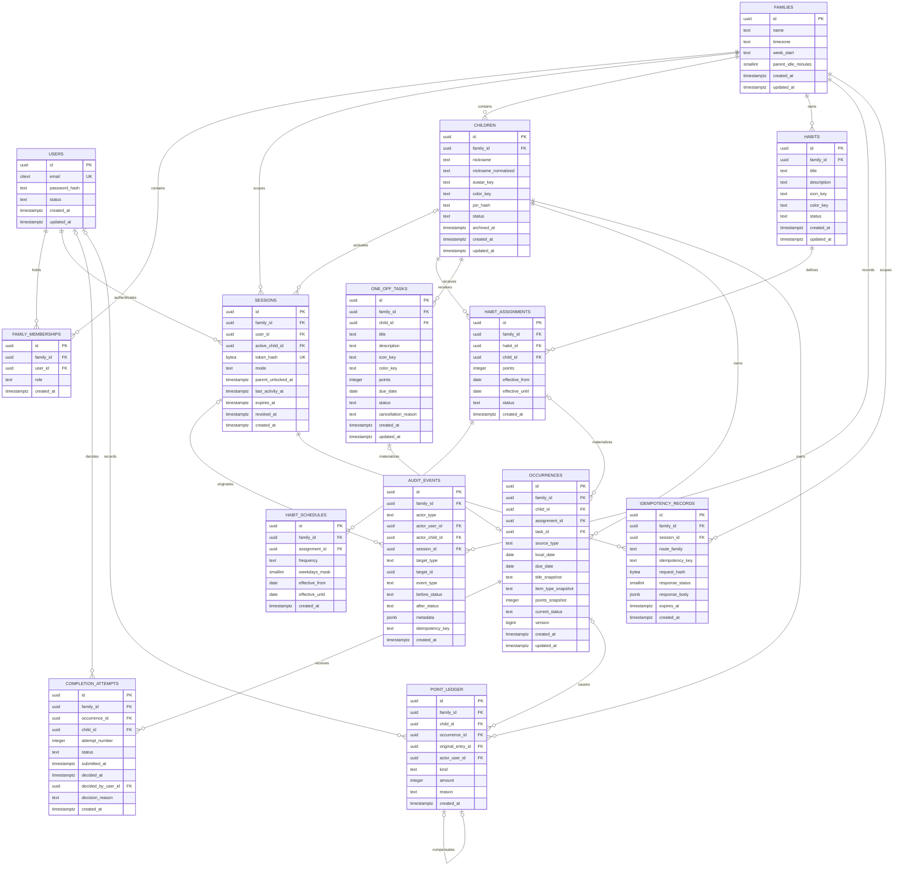

# Phase 2 Data Model

Status: **approved Phase 2 foundation**  
Authority: approved Phase 0 decisions, product requirements, technical requirements, and occurrence state machine.

## Modeling principles

- `families.id` is the tenant boundary. Every household-owned row carries `family_id`, including rows whose parent already implies it. This permits direct authorization predicates and composite foreign keys that prevent cross-household references.
- External identifiers are UUIDs generated by the application or PostgreSQL. Sequential identifiers are not exposed.
- Timestamps are `timestamptz` and represent UTC instants. Business dates are PostgreSQL `date` values interpreted in the owning family's IANA timezone.
- Mutable definitions are separated from immutable dated history. Occurrences snapshot the title, item type, and points.
- Completion attempts, ledger entries, and audit events are append-only.
- Status changes, attempt decisions, ledger writes, and audit events occur in one database transaction.
- Email is stored normalized for uniqueness while the originally entered form may be retained for display.
- Enum-like values use constrained text or PostgreSQL enums chosen consistently by the implementation. Adding a state must require a migration.

## Entity relationship diagram

Nullable relationships in the diagram are intentional. An occurrence has exactly one source: `assignment_id` for a recurring habit or `task_id` for a one-off task. A manual correction has no occurrence. An approval reversal references both its occurrence and original award.

## Required structural constraints

The migrations and integration tests must implement these rules rather than relying only on service validation:

| Area | Database rule |
|---|---|
| Membership | Unique `(family_id, user_id)`; MVP service rule allows exactly one active `owner` per family. |
| Child nickname | Partial unique index on `(family_id, nickname_normalized)` where `status = 'active'`. Normalization must be deterministic and shared with API validation. |
| Points | `points` and `points_snapshot` are between 1 and 10,000. Ledger `amount <> 0`; manual corrections are positive. |
| Week settings | `week_start IN ('monday', 'sunday')`; `parent_idle_minutes IN (5, 15, 30)`; timezone is validated against the runtime IANA database before storage. |
| Schedule | `frequency IN ('daily', 'selected_weekdays')`; daily uses all seven days or a canonical mask; selected weekdays has a non-zero seven-bit mask; effective end is null or not before start. |
| Assignment versions | No overlapping effective ranges for the same habit and child. Editing “this and future” closes the old range and inserts a new assignment/schedule version. |
| Occurrence source | Exactly one of `assignment_id` and `task_id` is non-null and agrees with `source_type`. |
| Occurrence identity | Unique `(family_id, assignment_id, child_id, local_date)` when assignment-backed; unique `(family_id, task_id)` when task-backed. |
| Occurrence snapshot | Non-empty title, valid positive points, immutable after insert; `version >= 1`. |
| Attempts | Unique `(family_id, occurrence_id, attempt_number)` and at most one open/submitted attempt per occurrence through a partial unique index. Decision columns must be all null while submitted and consistent with the terminal attempt state afterward. |
| Award | Partial unique index on `(family_id, occurrence_id)` for ledger kind `award`. |
| Reversal | Partial unique index on `original_entry_id` for kind `approval_reversal`; original entry is an award for the same family, child, and occurrence. Exact negation requires a deferred constraint trigger or transaction procedure plus integration tests. |
| Ledger | Entries are immutable. `award > 0`, `approval_reversal < 0`, `manual_correction > 0`; only reversal has `original_entry_id`. |
| Actors | Audit actor shape matches `actor_type`; secrets and unrestricted request bodies are forbidden in `metadata`. |
| Idempotency | Unique `(family_id, session_id, route_family, idempotency_key)`; request hash mismatch is a conflict, exact replay returns the stored response. |
| Tenant integrity | Household-owned references use composite foreign keys such as `(family_id, child_id) -> children(family_id, id)`, backed by unique `(family_id, id)` keys. |

PostgreSQL cannot express every transition rule with simple checks. State transitions must lock the occurrence (`SELECT ... FOR UPDATE`), check `version`, write all affected rows, increment the version, and commit atomically. Direct application-role updates to append-only tables and snapshot columns should be restricted through grants or guarded by triggers where practical.

## Household scoping map

| Entity | Direct scope | Cross-tenant defense | Child-visible scope |
|---|---|---|---|
| `users` | Global identity | Access through membership; never query household resources from user ID alone | Never |
| `families` | Its own `id` | Membership/session authorization | Safe household display fields only |
| `family_memberships` | `family_id` | Composite uniqueness and service authorization | Never |
| `sessions` | `family_id` | User membership plus optional composite active-child FK | Current safe session summary only |
| `children` | `family_id` | All selects/mutations require family predicate | Active session child only; profile picker gets a deliberately limited projection |
| `habits` | `family_id` | Composite assignment FK | Only snapshots through assigned occurrences |
| `habit_assignments` / `habit_schedules` | `family_id` | Composite FKs across family, habit, child | Only own scheduled result, not sibling assignments |
| `one_off_tasks` | `family_id` | Composite child FK | Only own task snapshot/action state |
| `occurrences` | `family_id` | Composite source and child FKs | Only rows matching session `active_child_id` |
| `completion_attempts` | `family_id` | Composite occurrence/child FKs | Only attempts for own occurrence; parent decision message is child-safe |
| `point_ledger` | `family_id` | Composite child/occurrence/original-entry relationships | Only own entries and balance |
| `audit_events` | `family_id` | Authorized parent/operations access only | Never in raw form |
| `idempotency_records` | `family_id` | Session-bound unique key | Never |

Repository functions for household data must accept `family_id` as a required parameter. Fetch-by-ID queries without a household predicate are prohibited outside narrowly reviewed infrastructure. Authorization tests must include a valid UUID belonging to a different family, not only nonexistent IDs.

## Entity lifecycle notes

### Identity, family, and sessions

- A user is registered, becomes the single owner through a membership, and creates or enters one family. Disabling a user revokes sessions but preserves authored history.
- A family is not hard-deleted in MVP. Timezone changes apply to future generation and presentation; stored occurrence `local_date` values are never rewritten.
- A session begins in a non-privileged/shared mode or authenticated parent mode. Selecting a child sets one active child and removes parent privilege immediately. Parent unlock has its own idle deadline inside the longer account-session lifetime. Logout, expiry, or security action sets `revoked_at`; session rows remain long enough for audit correlation.

### Children

- Children move from `active` to `archived`; history is never deleted. Archive removes the profile from the normal picker and prevents new child submissions.
- Pending work for an archived child remains visible to the parent for a decision. Existing occurrences, attempts, and ledger entries remain queryable.
- PIN replacement changes only `pin_hash`. No PIN or PIN-derived material appears in logs or audit metadata.

### Habit definitions, assignments, and schedules

- A habit is the reusable presentation definition. A child-specific assignment contains its point value and effective range; its schedule contains recurrence and its effective range.
- Multi-child habits always have separate assignment and occurrence rows per child.
- An edit effective on date D closes the old assignment/schedule on D-1 and inserts new version rows beginning D. It may replace future, unstarted materialized occurrences, but never pending/decided occurrences or immutable snapshots.
- Deactivation closes effective ranges and stops future materialization. Historical definitions remain for reporting.

### One-off tasks and occurrences

- Creating a task creates or deterministically permits materialization of its single occurrence. Its due date remains the occurrence date; overdue status is derived from household-local today rather than stored as another state.
- A task can be edited only while its occurrence is unstarted. Cancellation transitions its unstarted or pending occurrence to terminal `cancelled`, closes an open attempt consistently, and records a reason and audit event atomically.
- Recurring occurrences are actionable only when household-local today equals `local_date`. One-off occurrences remain actionable on and after `due_date` until decided or cancelled.
- Occurrence states are `not_started`, `pending_approval`, `approved`, `approval_reversed`, and `cancelled`. Rejection and withdrawal finalize an attempt and return the occurrence to `not_started`.

### Attempts, points, and audit

- Submit inserts the next numbered attempt and moves the occurrence to `pending_approval`. Withdraw or reject finalizes that attempt. A later submit creates a new row; attempts are never reused.
- Approval finalizes the open attempt, moves the occurrence to `approved`, inserts exactly one award, and writes the audit event in one transaction.
- Reversal moves an approved occurrence to terminal `approval_reversed` and creates exactly one negative ledger entry that references and negates the award. Neither entry is edited or deleted.
- Manual corrections are positive, child-specific ledger entries with a parent actor and required reason. They do not change occurrence state.
- Balance is `SUM(point_ledger.amount)` by family and child. A cached balance projection may be added only if updated in the same ledger transaction and reconciliation is tested.

## Requirement and invariant traceability

| Requirement | Model support and invariant | Phase 2 proof |
|---|---|---|
| PR-01 | User, family, owner membership, revocable session; validated timezone/week start and parent idle options | Migration constraints; cross-family session tests |
| PR-02 | Family-scoped child; partial unique active nickname; archive timestamp/status; optional slow PIN hash | Duplicate-active-name and archival-history tests |
| PR-03 | Session mode and exactly one optional active child; parent unlock separated from child mode | Composite child scope and session-state tests |
| PR-04 | Reusable habit, per-child effective assignment, schedule range, point checks, immutable occurrence snapshots | Range, weekday-mask, source identity, and snapshot tests |
| PR-05 | One-off task with one child/due date; unique task occurrence; derived overdue actionability; terminal cancellation | Unique task occurrence and cancellation transition tests |
| PR-06 | Child/date-scoped occurrences with canonical statuses and snapshot display data | Local-date/DST utilities and child-scope query tests |
| PR-07 | Append-only numbered attempts, occurrence version, one open attempt, atomic approval/award/audit, idempotency record | Concurrency and rollback integration tests |
| PR-08 | Append-only child ledger, unique award/reversal, exact compensation, additive correction, terminal reversal | Duplicate award, double reversal, exact-negation, and sum tests |
| PR-09 | Family-local occurrence dates and immutable statuses/ledger provide daily, weekly, monthly aggregation inputs | Week-start, month, timezone, and DST boundary tests |
| PR-10 | No special persistence beyond stable textual statuses, avatar/color keys, and safe projections; UI accessibility remains later-phase work | API enum/error contract review |

## Sensitive-data classification

| Class | Data | Handling requirements |
|---|---|---|
| Secret authentication material | Password hashes, parent/child PIN hashes, session token hashes, CSRF secrets | Never returned or logged; encrypted transport; restricted database access; backups encrypted; erase plaintext immediately after verification |
| Personal account data | Parent email, account status, membership | Parent/operations only; redact logs; normalize safely; include in access/deletion procedures when those are designed |
| Child personal data | Nickname, avatar/color choice, child PIN hash | Minimize collection; household-only; no public URLs/profiles; do not collect birth date, photo, address, school, or notes |
| Child behavioral data | Assignments, occurrences, submissions, decisions, points, reports | Household-confidential; a child sees only their own detail; siblings do not receive raw detail by default |
| Security/audit data | Actor IDs, session ID, IP-derived/rate-limit signals if later stored, event metadata, idempotency request hashes | Parent/operations restricted; defined retention; metadata allowlist; never include cookies, credentials, PINs, full request bodies, or sensitive headers |
| Low-sensitivity configuration | Family display name, timezone, week start, icon/color keys | Still household-scoped; safe projections only |

The application should use opaque avatar keys for bundled illustrations. If uploaded photos are introduced later, they require a new storage, consent, retention, and access-control review and are not covered by this model.

## Phase 2 data-model review checklist

- [x] Product owner confirms the approved timezone/week-start decision is the source of truth (browser suggestion, initial `Asia/Jakarta`/Sunday defaults), superseding the earlier Europe/Berlin/Monday summary.
- [x] Backend owner uses PostgreSQL enums for finite lifecycle states and checks for bounded scalar values.
- [x] Migrations create every entity and required index/constraint above from an empty PostgreSQL 16 database.
- [x] Every household-owned foreign key enforces same-family relationships structurally where PostgreSQL permits it.
- [x] Generated repository queries carry explicit household identifiers; authorization behavior is implemented and tested with each feature phase.
- [ ] Effective-date ranges cannot overlap and date edits preserve pending/decided snapshots.
- [x] Occurrence source XOR and both uniqueness identities are database-enforced; concurrent service materialization is tested in Phase 5.
- [x] Attempt state/decision columns and at-most-one-open-attempt are database-enforced.
- [ ] Approval, award, occurrence version, attempt decision, and audit event commit or roll back together.
- [ ] Exact idempotent replay returns the stored response; key reuse with a different request hash conflicts.
- [x] Award and reversal uniqueness plus exact-negation behavior are database-enforced; transition-level integration coverage is completed in Phase 7.
- [ ] Append-only tables and snapshot columns cannot be silently rewritten through normal repositories.
- [x] Time utilities test household-local dates and DST gaps/folds; report period boundaries are completed with reporting in Phase 8.
- [ ] Logs and audit metadata are verified not to contain classified secret data.
- [x] Migration rollback policy is documented; production uses forward fixes and backups rather than assuming destructive down migrations are safe.
- [x] The OpenAPI contract uses the same status names, identifiers, error codes, and concurrency semantics as this model.

## Resolved decision

The approved Phase 0 record and formal PR-01 specify browser timezone suggestion with initial defaults of `Asia/Jakarta` and Sunday. These approved values supersede the earlier conversational Europe/Berlin and Monday summary and are encoded in the current migration defaults.
